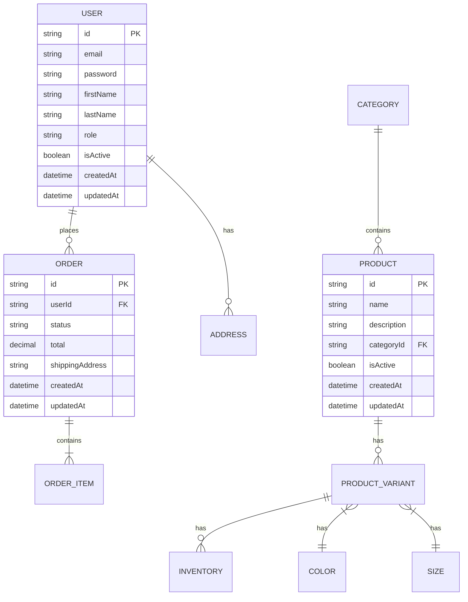

# 🚀 Shoe‑Order

[](https://github.com/company/zapateria-online/actions/workflows/ci-cd.yml)
[](https://codecov.io/gh/company/zapateria-online)

Plataforma integral de gestión de zapatería basada en pedidos

> Venta, personalización y administración de calzado con arquitectura moderna y escalable.

## 📋 Tabla de Contenidos

- [Descripción](#-descripción)
- [Estructura del Proyecto](#-estructura-del-proyecto)
- [Requisitos del Sistema](#-requisitos-del-sistema)
- [Configuración del Entorno de Desarrollo](#-configuración-del-entorno-de-desarrollo)
- [Uso](#-uso)
- [Despliegue en Producción](#-despliegue-en-producción)
- [Flujos Principales](#-flujos-principales)
- [Tecnologías](#-tecnologías)
- [Base de Datos](#-base-de-datos)
- [Contribuir](#-contribuir)
- [Licencia](#-licencia)
- [Contacto](#-contacto)
- [Próximas Características](#-próximas-características)

## 📖 Descripción

Shoe‑Order es una solución completa para gestionar una zapatería online con:
- Catálogo dinámico de productos
- Personalización interactiva de calzado
- Procesos de compra y seguimiento
- Panel administrativo avanzado
- Aplicación móvil para clientes

## 🖥️ Requisitos del Sistema

- Docker 20.10+
- Docker Compose 1.29+
- Node.js 18+
- npm 9+ o yarn 1.22+
- Git

## 🛠️ Configuración del Entorno de Desarrollo

### 1. Clonar el repositorio

```bash
git clone https://github.com/tu-usuario/zapateria.git
cd zapateria
```

### 2. Configurar variables de entorno

```bash
cp .env.example .env
# Editar el archivo .env según tus necesidades
```

### 3. Iniciar los servicios con Docker

```bash
docker-compose up -d
```

### 4. Instalar dependencias

```bash
# Instalar dependencias del backend
docker-compose exec backend npm install

# Instalar dependencias del frontend
docker-compose exec frontend npm install

# Instalar dependencias del panel de administración
docker-compose exec admin npm install
```

### 5. Ejecutar migraciones de la base de datos

```bash
./scripts/db-migrate.sh run
```

### 6. Poblar la base de datos con datos de prueba (opcional)

```bash
docker-compose exec backend npm run seed:run
```

### 7. Iniciar los servicios en modo desarrollo

```bash
docker-compose up
```

## 🚀 Uso

### Servicios disponibles

- **Frontend**: http://localhost:3000
- **Backend API**: http://localhost:3001/graphql
- **Admin Dashboard**: http://localhost:3002
- **Base de datos**: PostgreSQL en localhost:5432
- **Redis**: localhost:6379
- **PgAdmin** (opcional): http://localhost:5050

### Comandos útiles

```bash
# Ejecutar migraciones
./scripts/db-migrate.sh run

# Crear una nueva migración
./scripts/db-migrate.sh create NombreDeLaMigracion

# Revertir la última migración
./scripts/db-migrate.sh revert

# Ver estado de las migraciones
./scripts/db-migrate.sh show

# Ejecutar tests
./scripts/test.sh

# Formatear código
./scripts/format.sh
```

## 🚀 Despliegue en Producción

### 1. Configurar variables de entorno de producción

```bash
cp .env.example .env.prod
# Editar el archivo .env.prod con las configuraciones de producción
```

### 2. Construir y desplegar los servicios

```bash
docker-compose -f docker-compose.yml -f docker-compose.prod.yml up -d --build
```

### 3. Ejecutar migraciones en producción

```bash
NODE_ENV=production ./scripts/db-migrate.sh run
```

### 4. Configurar Nginx y SSL (recomendado)

Ver la configuración en `nginx/nginx.conf` y configurar tu dominio y certificados SSL.

## 🗄️ Base de Datos

### Diagrama ERD



### Migraciones

El proyecto utiliza TypeORM para la gestión de migraciones. Los archivos de migración se encuentran en `backend/src/migrations/`.

#### Crear una nueva migración

```bash
./scripts/db-migrate.sh create NombreDeLaMigracion
```

#### Ejecutar migraciones

```bash
./scripts/db-migrate.sh run
```

#### Revertir la última migración

```bash
./scripts/db-migrate.sh revert
```

## 🗂 Estructura del Proyecto

```
zapateria-online/
├── frontend/          # Cliente React.js 
├── backend/           # API RESTful Node.js/Express
├── mobile-app/        # App móvil React Native
├── admin-dashboard/   # Panel de gestión interna
├── database/          # Esquemas y migraciones
├── docs/              # Documentación técnica y usuarios
├── infrastructure/    # Docker, K8s, CI/CD
├── tests/             # Unit, integration y e2e
└── scripts/           # Tareas automatizadas
```
## ⚙️ Instalación

### Requisitos previos
- Node.js (v16 o superior)
- Docker y Docker Compose
- Git

### Pasos de instalación

```bash
# Clonar el repositorio
git clone https://github.com/company/zapateria-online.git
cd zapateria-online

# Configurar variables de entorno
cp .env.example .env
# Editar el archivo .env con tus credenciales

# Iniciar contenedores
docker-compose up -d

# Instalar dependencias
npm run install:all

# Ejecutar migraciones y seeders
npm run migrate
npm run seed

# Iniciar el entorno de desarrollo
npm run dev
```
## 🚀 Uso

### Frontend Web
- **URL**: http://localhost:3000
- **Funcionalidades**: Explora el catálogo, personaliza calzado y realiza compras

### Panel de Administración
- **URL**: http://localhost:3001
- **Funcionalidades**: Gestión de productos, inventario y visualización de KPIs

### Aplicación Móvil
- **Instalación**: 
  - Descarga la APK desde `mobile-app/build`
  - O ejecuta `npm run android` para desarrollo

## 🔄 Flujos Principales

### 1. Proceso de Compra
- **Explorar catálogo**: `src/pages/Catalog.jsx`
- **Personalizar**: `src/components/customization/ShoeDesigner.jsx`
- **Checkout**: `src/pages/Checkout.jsx`
- **Seguimiento**: `src/pages/OrderTracking.jsx`

### 2. Administración
- **Gestión de pedidos**: `admin-dashboard/src/pages/Orders.jsx`
- **Control de inventario**: `admin-dashboard/src/pages/Inventory.jsx`
- **Notificaciones**: `backend/src/services/notification.service.js`

## 🛠 Tecnologías

### Frontend
- React
- Context API
- Styled Components
- Axios
- React Router

### Backend
- Node.js
- Express
- PostgreSQL
- Redis
- JWT
- Joi

### Infraestructura
- Docker
- AWS (EC2, S3, RDS)
- GitHub Actions
- Nginx
- ELK Stack

## 🤝 Contribuir

1. Haz un fork del proyecto
2. Crea una rama: `git checkout -b feature/tu-cambio`
3. Sigue las convenciones de [Conventional Commits](https://www.conventionalcommits.org/)
4. Envía tus cambios: `git push origin feature/tu-cambio`
5. Abre un Pull Request contra la rama `develop`
6. Asegúrate de que todos los tests y linters pasen:
   ```bash
   npm test
   ```

## 📜 Licencia

MIT © 2025 Shoe‑Order. Consulta el archivo [LICENSE](LICENSE) para más detalles.

## 📬 Contacto

- **Soporte**: [support@shoe-order.com](mailto:support@shoe-order.com)
- **Reportar problemas**: [Abre un issue](https://github.com/company/zapateria-online/issues)

## 🌱 Próximas Características

- 🕵️‍♂️ Búsqueda por imagen de zapato
- 🤖 Recomendaciones con IA según historial
- 📦 Múltiples pasarelas de pago
- 🌐 Multi-idioma y multi-moneda

---

**¡Lleva tu zapatería al siguiente nivel!**